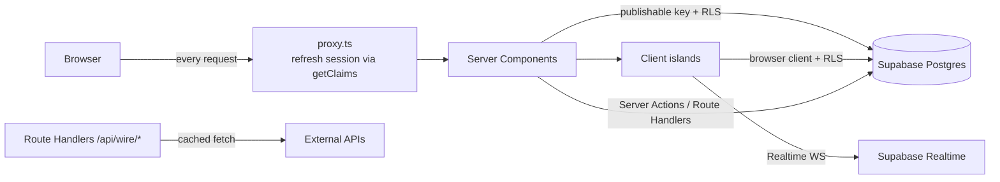
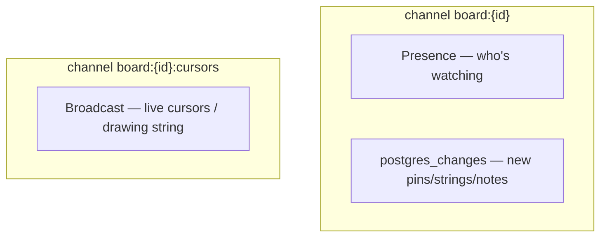

# ARCHITECTURE.md

How REDTHREAD fits together. See [`DATA_MODEL.md`](DATA_MODEL.md) for the schema
and [`adr/`](adr/) for the decisions behind these choices.

## Stance

The graph is the product, so the data model is **node/edge-first** and the
Evidence Board is the only heavy client island. Everything else (Dispatches,
archive, dossiers, the Wire shell, search) is **Server Components by default**,
with small client leaves for interactivity. This keeps the immersive theme cheap
to render and SEO-friendly, while `@xyflow/react` is isolated behind a
`'use client'` + `ssr:false` boundary.

## Request flow

## Trust boundaries (Supabase)

Three clients, three privilege levels — see [`lib/supabase/`](../lib/supabase):

- `client.ts` — browser, **publishable** key. RLS enforces everything.
- `server.ts` — Server Components/Actions/Route Handlers, publishable key, reads
  the session from cookies. Authorize with `getClaims()`.
- `admin.ts` — **service-role secret** key, `server-only`. Bypasses RLS. Used only
  for moderation + cron (Phase 3+). Never imported by a component.

`proxy.ts` refreshes the auth cookie on every request. **Never** put logic between
client creation and `getClaims()` in the middleware helper.

## Rendering & client islands

- Pages render on the server. Add `"use client"` only for interactivity.
- The Evidence Board (`components/board/`, Phase 2) is dynamically imported with
  `ssr:false` and shows a themed "DECRYPTING…" placeholder while loading. Node
  `width/height` are persisted so there's no layout jump.
- The board page's dossier header still SSRs for SEO/social cards.

## Realtime (Phase 2)

Per-board channels, all `private: true`:

Every realtime hook returns an unsubscribe that calls `removeChannel` — leaked
channels are the #1 Supabase footgun. postgres_changes handlers reconcile into
react-flow state by id, ignoring echoes of the local user's own optimistic edits.

## The Wire (Phase 3)

External GETs go through `app/api/wire/*/route.ts` (HTTP/CDN caching, keys stay
server-side). A Vercel Cron job snapshots top items into the `signals` table so
"pin a signal" has a durable FK target and the feed survives upstream outages.
See [`API_INTEGRATIONS.md`](API_INTEGRATIONS.md).

## Current state (Phase 0)

Scaffold + theme + Supabase clients + `proxy.ts` + `profiles` migration + docs.
Identity/forum (Phase 1), board (Phase 2), Wire (Phase 3), and
search/moderation/polish (Phase 4) follow per [`ROADMAP.md`](ROADMAP.md).
