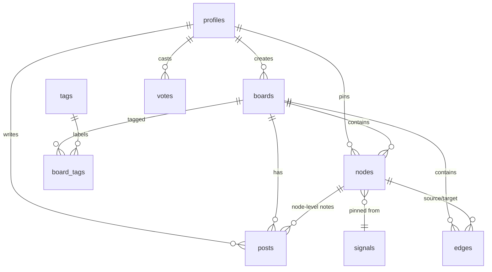

# DATA_MODEL.md

The Postgres schema (Supabase). Node/edge-first, because the graph is the product.
Conventions: `uuid` PKs (`gen_random_uuid()`), `timestamptz` defaults, soft-delete
(`deleted_at`) on user content, `citext` for case-insensitive unique handles/slugs.

> **Status:** Phase 0 ships `profiles` only
> ([`supabase/migrations/`](../supabase/migrations)). The rest below is the target
> model, added per phase. RLS is enabled on every user-data table.

## ERD (target)

## Enums

`clearance_rank` (sheeple→architect, **shipped**), plus planned: `node_type`
(theory/person/event/document/location/media/claim/signal), `edge_kind`
(connects/supports/contradicts/causes/alias_of/funds/located_at/timeline),
`vote_target` (node/edge/post), `vote_value` (corroborate/discredit),
`board_visibility` (public/unlisted/private), `board_status` (open/cold/closed),
`report_status` (open/reviewing/actioned/dismissed).

## Tables

| Table | Purpose | Key columns |
|---|---|---|
| `profiles` ✅ | pseudonymous identity, 1:1 `auth.users` | `shadow_name` (citext uniq), `rank`, `credibility` |
| `boards` | case files | `slug`, `title`, `summary`, `visibility`, `status`, `created_by`, denorm `node_count`/`watcher_count` |
| `nodes` | pins | `board_id`, `type`, `title`, `body`, `x`/`y`/`rotation`/`w`/`h`, `media_url`, `source_url`, `signal_id`, `metadata` jsonb, `score` |
| `edges` | red strings | `board_id` (denorm), `source_node_id`, `target_node_id`, `label`, `kind`, `score`; `check(source<>target)`, `unique(source,target,kind)` |
| `posts` | case-notes | `board_id`, `node_id?`, `parent_id?` (replies), `body`, `score` |
| `votes` | corroborate/discredit | `voter_id`, `target_type`, `target_id`, `value`; `unique(voter,target_type,target_id)` |
| `tags`, `board_tags` | taxonomy | slug/label; join |
| `reports` | moderation queue | `target_type/id`, `reason`, `status` |
| `signals` | cached external API items (The Wire) | `source`, `external_id`, `kind`, `title`, `occurred_at`, `lat`/`lng`, `payload`; `unique(source,external_id)` |

`pgvector` (suggested connections) is **v2** — a future `nodes.embedding` column +
HNSW index. Not created in v1.

## Triggers / functions

- `handle_new_user()` ✅ — on `auth.users` insert → create `profiles` row with a
  placeholder shadow_name (SECURITY DEFINER, `search_path=public`).
- `touch_updated_at()` ✅ — generic `before update` to bump `updated_at`.
- `apply_vote()` (Phase 1) — maintains target `score` + author `credibility`.
- `bump_board_counts()` (Phase 2) — maintains `boards.node_count`.

## RLS model

Enabled on every user-data table. The central predicate is "can the caller read
this board?" — factored into a `STABLE SECURITY DEFINER` helper
`can_read_board(uuid)`; `nodes`/`edges`/`posts` inherit board visibility.

- **profiles** ✅ — world-readable; insert/update self only.
- **boards** — read public-or-owner; insert/update owner; auth required to insert.
- **nodes/edges/posts** — read if board readable; insert if authed + can read
  board; update owner only.
- **votes** — a user manages only their own rows.
- **signals/tags** — public read, **service-role write** only (server proxy/cron).

**Performance idiom (mandatory):** write `(select auth.uid())` so it evaluates
once per query (initPlan), not per row. Index every FK and every column referenced
in a policy; denormalize `board_id` onto `edges`/`posts` to avoid a join in the
policy.

## Migrations

One concern per timestamped file in `supabase/migrations/`. All RLS policies for a
phase go in a single, reviewable file. `supabase/seed.sql` seeds a demo board
("The Denver Airport Files") so preview branches aren't empty. Applied via the
Supabase GitHub app on push, or `supabase db push` locally
([`RUNBOOK.md`](RUNBOOK.md)).
